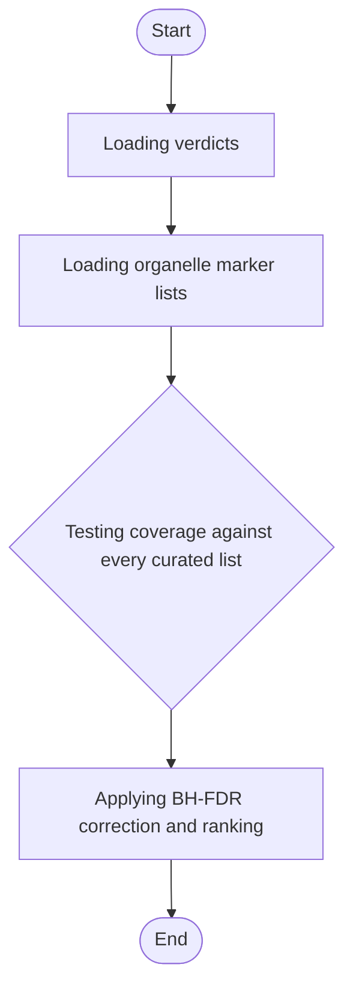

# Lyso-IP Organelle Coverage


## Installation

**[⬇️ Click here to install in Cauldron](http://localhost:50060/install?repo=https%3A%2F%2Fgithub.com%2Fnoatgnu%2Flysoip-organelle-coverage-plugin)** _(requires Cauldron to be running)_

> **Repository**: `https://github.com/noatgnu/lysoip-organelle-coverage-plugin`

**Manual installation:**

1. Open Cauldron
2. Go to **Plugins** → **Install from Repository**
3. Paste: `https://github.com/noatgnu/lysoip-organelle-coverage-plugin`
4. Click **Install**

**ID**: `lysoip-organelle-coverage`  
**Version**: 1.0.0  
**Category**: lysoip-qc  
**Author**: CauldronGO Team

## Description

Two one-sided Fisher's exact tests asking whether marker genes clear the Positive/Negative gate more often than the run's own background, optionally ranked across every curated list


## Workflow Diagram



## Runtime

- **Environments**: `python`

- **Entrypoint**: `lysoip_organelle_coverage.py`

## Inputs

| Name | Label | Type | Required | Default | Visibility |
|------|-------|------|----------|---------|------------|
| `verdict_file` | Verdicts | file | Yes | - | Always visible |
| `organelle_list` | Expected Organelle List | select (LSD (Platt 2018) (53 genes), Lysosome (Hein 2025) (158 genes), LSD + Lysosome (180 genes), ER (Hein 2025) (349 genes), Golgi (Hein 2025) (87 genes), Endosome (Park and Itzhak 2022) (93 genes), Mitochondria (Rath 2021) (1136 genes), Ribosome (Nakao 2004) (80 genes), Nucleus (Leung 2006) (410 genes)) | Yes | LSD + Lysosome | Always visible |
| `test_all_lists` | Test Against Every List | boolean | No | false | Always visible |
| `coverage_alpha` | Coverage Alpha | number (min: 0, max: 1, step: 0) | No | 0.05 | Always visible |

### Input Details

#### Verdicts (`verdict_file`)

verdict.tsv from the Lyso-IP Gating & Ranking plugin


#### Expected Organelle List (`organelle_list`)

Curated marker-gene list bundled with this plugin, same source as the Lyso-IP Organelle Specificity plugin

- **Options**: `LSD (Platt 2018)` (LSD (Platt 2018) (53 genes)), `Lysosome (Hein 2025)` (Lysosome (Hein 2025) (158 genes)), `LSD + Lysosome` (LSD + Lysosome (180 genes)), `ER (Hein 2025)` (ER (Hein 2025) (349 genes)), `Golgi (Hein 2025)` (Golgi (Hein 2025) (87 genes)), `Endosome (Park and Itzhak 2022)` (Endosome (Park and Itzhak 2022) (93 genes)), `Mitochondria (Rath 2021)` (Mitochondria (Rath 2021) (1136 genes)), `Ribosome (Nakao 2004)` (Ribosome (Nakao 2004) (80 genes)), `Nucleus (Leung 2006)` (Nucleus (Leung 2006) (410 genes))

#### Test Against Every List (`test_all_lists`)

When enabled, tests coverage against every curated list (not just the expected one), BH-FDR corrects across the panel, and ranks best-match-first — useful for diagnosing a mismatched or contaminated sample


#### Coverage Alpha (`coverage_alpha`)

p-value threshold for calling a list's enrichment significant


## Outputs

| Name | File | Type | Format | Description |
|------|------|------|--------|-------------|
| `organelle_coverage` | `organelle_coverage.tsv` | data | tsv | One row per tested organelle list with marker/background Positive/Negative/Nonsignificant counts, Fisher's exact p-values, and (when testing all lists) BH-FDR-corrected q-values, ranked best-match-first |

## Requirements

- **Python Version**: >=3.11

### Package Dependencies (Inline)

Packages are defined inline in the plugin configuration:

- `scipy>=1.11.0`

> **Note**: When you create a custom environment for this plugin, these dependencies will be automatically installed.

## Example Data

This plugin includes example data for testing:

```yaml
  verdict_file: examples/verdict.tsv
  organelle_list: LSD + Lysosome
```

Load example data by clicking the **Load Example** button in the UI.

## Usage

### Via UI

1. Navigate to **lysoip-qc** → **Lyso-IP Organelle Coverage**
2. Fill in the required inputs
3. Click **Run Analysis**

### Via Plugin System

```typescript
const jobId = await pluginService.executePlugin('lysoip-organelle-coverage', {
  // Add parameters here
});
```
